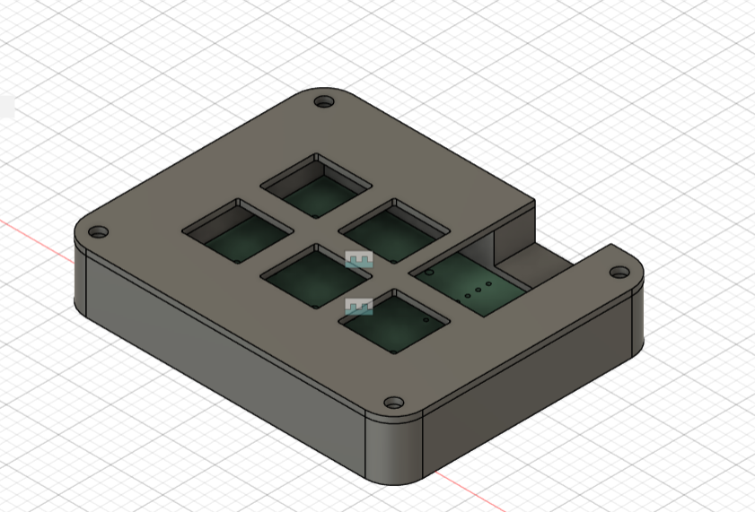
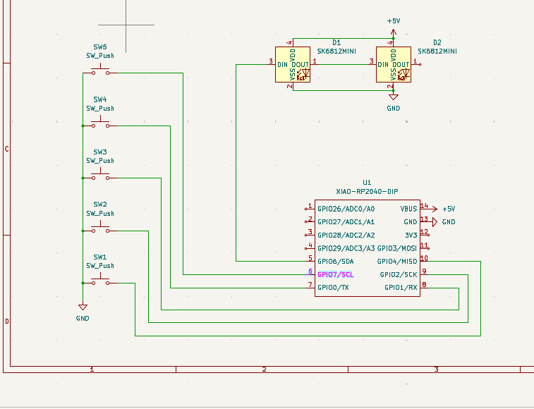
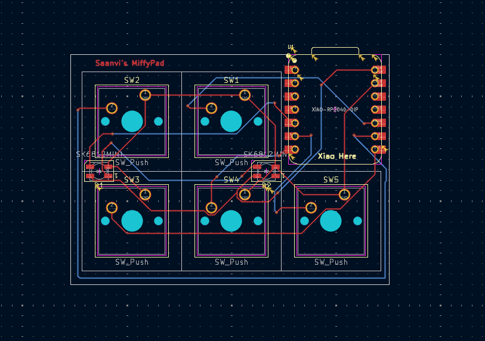

# MiffyPad
This is a keypad that I made based on Miffy as an accessory

## Schematic

## PCB

## CAD

## BOM:

Here is everything needed to make this hackpad (All parts are part of the approved kit)
- 5x Cherry MX Switches
- 5x DSA Keycaps
- 4x M3x5x4 Heatset inserts
- 4x M3x16mm screws
- 2x SK6812 MINI-E LEDs
- 1x XIAO RP2040
- 2x Printed parts for the case
